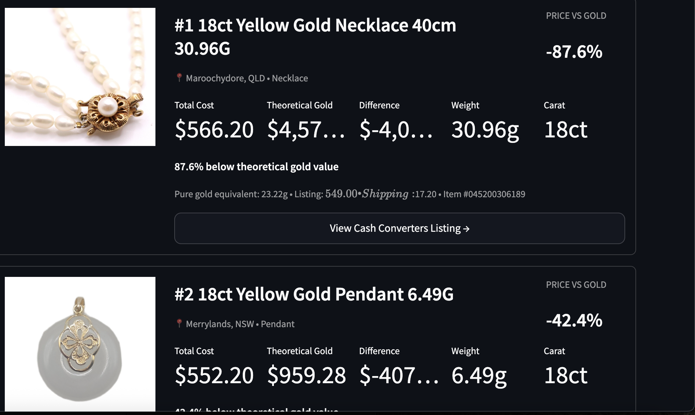

# Cashies Gold Finder

Scans Cash Converters jewellery listings, estimates contained gold value, and
ranks potential bargains.

## Deal estimates

The app defaults to a 90% expected melt payout. Estimated resale value is the
theoretical gold value multiplied by that payout; estimated profit subtracts
the listing price and shipping. The 0-100 Deal Score combines percentage
margin, dollar profit, and verification confidence. It is a comparison tool,
not a guaranteed resale quote.

Run `python listing_finder.py`, then launch the interface with
`streamlit run app.py`.

## Known issues

Had difficulty filtering images like this, its pearls but is being categorised as 9ct gold which isnt what I want

